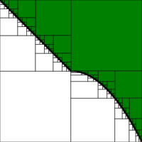

# Monotone Bipartition
<figure>
  
  <figcaption>
     Compute Monotone Threshold Surfaces and compute distances between surfaces.
  </figcaption>

</figure>

[](https://travis-ci.org/mvcisback/monotone-bipartition)
[](https://codecov.io/gh/mvcisback/monotone-bipartition)
[](https://pyup.io/repos/github/mvcisback/monotone-bipartition/)

[](https://badge.fury.io/py/monotone-bipartition)
[](https://opensource.org/licenses/MIT)


# Installation
Note, this project requires python 3.6+

`pip install -r requirements.txt`

or 

`python setup.py develop`

# Usage

```python
import monotone_bipartition as mbp

partition = mbp.from_threshold(
    func=lambda x: x[0] + x[1] >= 0.5,
    dim=2,
)  # type: mbp.BiPartition
```

- TODO: restrict to closed boundaries.
- TODO: move to logical lens library

Example notebook used in RV2018 submission: https://gist.github.com/mvcisback/e339530f90a380ad1b36ed4e2291c988
